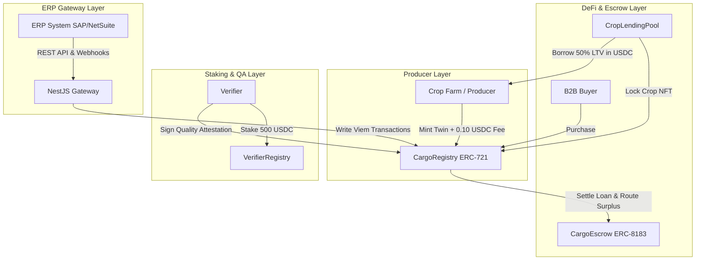

# CargoTrust (Decentralized Supply Chain Identity & Traceability Platform)

**CargoTrust** is a production-grade, decentralized supply chain identity, quality attestation, and payment-linked commerce platform deployed on the **Arc Testnet**, utilizing **USDC** as both the native gas token and the asset exchange currency. 

The platform guarantees crop provenance, integrates quality inspections via cryptographically signed W3C Verifiable Credentials, and enables secure, atomic B2B ownership routing through stablecoin smart contracts.

---

## 🚀 Deployed Contract Addresses
*   **CargoRegistry (ERC-721)**: [`0x2b27B16F0AAf518FF91690Df2B4FA39C5f5BCe99`](https://testnet.arcscan.app/address/0x2b27B16F0AAf518FF91690Df2B4FA39C5f5BCe99)
*   **CargoEscrow (ERC-8183 Smart Escrow)**: [`0x935603281481F1c9acf1454964FF5DA7EBfc8Ff9`](https://testnet.arcscan.app/address/0x935603281481F1c9acf1454964FF5DA7EBfc8Ff9)
*   **AgentRegistry (ERC-8004 Compliance Identity)**: [`0x33af1Df6e803E6ceAAF06615e85eA5732C44522C`](https://testnet.arcscan.app/address/0x33af1Df6e803E6ceAAF06615e85eA5732C44522C)
*   **VerifierRegistry (Stake-Backed Registry)**: [`0xc2c23E68C55C2d598bdA0B6a8e7C570A79fe3A42`](https://testnet.arcscan.app/address/0xc2c23E68C55C2d598bdA0B6a8e7C570A79fe3A42)
*   **CropLendingPool (NFT Collateral Lending)**: [`0xDE647D20c6A05A4a5f9D31f35496A08E443e9869`](https://testnet.arcscan.app/address/0xDE647D20c6A05A4a5f9D31f35496A08E443e9869)
*   **Network**: Arc Testnet (Chain ID: `5042002`, native gas token is USDC)

---

## 🛠️ Architecture & Tech Stack



### 1. Technology Infrastructure
*   **Smart Contracts**: Solidity `v0.8.20` compilation utilizing Hardhat and OpenZeppelin libraries.
*   **Frontend**: Next.js App Router with TypeScript.
*   **ERP Gateway**: NestJS framework with JWT authentication and cryptographically signed (HMAC-SHA256) Webhook event watcher.
*   **Web3 Integrations**: RainbowKit, Wagmi, and Viem.
*   **Telemetry**: Circle CLI and Circle Agent Stack integrations for IoT wallets.

### 2. Dual Decimal System Implementation
To bypass the transaction failure bugs common in gas precompiled stablecoin chains, CargoTrust implements a precise mathematical dual-decimal parser:
*   **USDC Native Gas**: Arc precompiles use **18 decimals** for gas estimations and native balance checks.
*   **USDC ERC-20 Asset**: Standard ERC-20 transfers (like B2B trade prices and the 0.10 USDC flat fee) use **6 decimals**.

---

## 💎 Core Platform Features

### 🍏 Feature A: Product Digital Twin Creator & Splitting
Allows crop producers to mint an ERC-721 digital twin representing their batch with origin location, harvest dates, and weights. Large batches can be divided into smaller child batches that retain full provenance links to their parent token.

### 🛒 Feature B: Payment-Linked Ownership Transfer & Smart Escrow (ERC-8183)
Buyers can purchase active listings directly. The platform routes funds through `CargoEscrow.sol` (ERC-8183), locking payments in escrow until verifiers certify the quality of the crop, or releasing refunds in the event of transit delay or cargo spoilage.

### 🧪 Feature C: Stake-Backed Verifier Registry
Quality inspectors are required to stake a minimum of **500 USDC** to gain credential publishing authorizations. Staked assets are subject to slashing penalties if fraudulent attestations or damaged crop twins are validated.

### 🌾 Feature D: Collateralized Crop Lending Pool
Producers can lock their listed crop batch NFTs inside `CropLendingPool.sol` to borrow up to **50% LTV** of the listing price in USDC for immediate liquidity, with automatic registry-level settlement upon crop sales.

### 🔒 Feature E: Opt-In Metadata Privacy & ECDH Sharing
Enterprise users can encrypt sensitive crop metadata (origin, coordinates, description, price) locally using AES-256. Cryptographic keys are exchanged securely between farmers and approved buyers using Elliptic Curve Diffie-Hellman (ECDH) key sharing.

### 🔌 Feature F: Enterprise ERP API Gateway & Webhooks
Exposes developer API keys, HTTPS webhooks, and REST endpoints. Enables third-party business systems (like SAP or NetSuite) to synchronize inventory and programmatically trigger on-chain mints, listings, and purchases.

---

## 💻 Setup & Local Development

### 1. Smart Contract Compilation & Deployment
The contract workspace compiles using standard Hardhat packages:
```bash
# Go to contracts folder
cd contracts

# Install dependencies
npm install

# Compile smart contracts
npx hardhat compile

# Deploy smart contracts to Arc Testnet
node deploy.mjs
```

### 2. Frontend Development & Run
The React and Next.js frontend builds type-safely and loads dynamically:
```bash
# Go to web folder
cd ../web

# Install dependencies
npm install

# Run the development environment
npm run dev

# Build the optimized production bundle
npm run build
```

### 3. NestJS ERP Gateway Run
Launch the local ERP API server to sync inventory and trigger transactions:
```bash
# Go to gateway folder
cd ../gateway

# Install dependencies
npm install

# Build the NestJS project
node_modules/typescript/bin/tsc -p tsconfig.build.json

# Start the gateway
npm run start
```

---

*Designed for the Stablecoins Commerce Stack Challenge.*
