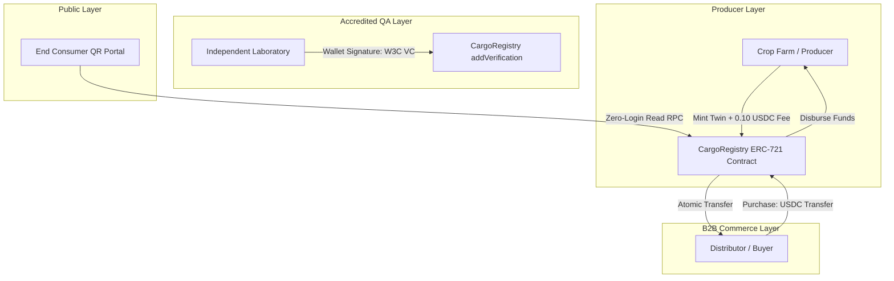

# CargoTrust (Decentralized Supply Chain Identity & Traceability Platform)

**CargoTrust** is a production-grade, decentralized supply chain identity, quality attestation, and payment-linked commerce platform deployed on the **Arc Testnet**, utilizing **USDC** as both the native gas token and the asset exchange currency. 

The platform guarantees crop provenance, integrates quality inspections via cryptographically signed W3C Verifiable Credentials, and enables secure, atomic B2B ownership routing through stablecoin smart contracts.

---

## 🚀 Deployed Contract Address
*   **Contract Name**: `CargoRegistry`
*   **Network**: Arc Testnet (Chain ID: `5042002`)
*   **Deployed Address**: [`0xAb67E0c298250d4714c3a06Ea951aAF11c17014b`](https://testnet.arcscan.app/address/0xAb67E0c298250d4714c3a06Ea951aAF11c17014b)
*   **Explorer Audit Link**: [ArcScan - CargoRegistry Address](https://testnet.arcscan.app/address/0xAb67E0c298250d4714c3a06Ea951aAF11c17014b)

---

## 🛠️ Architecture & Tech Stack



### 1. Technology Infrastructure
*   **Smart Contracts**: Solidity `v0.8.20` self-contained, highly gas-optimized ERC-721 with customized payment interfaces.
*   **Frontend**: Next.js App Router with TypeScript.
*   **Web3 Integrations**: RainbowKit `v2.2.3` for browser wallet interfaces, Wagmi `v2.5.11`, and Viem `v2.8.12`.
*   **Styling & FX**: Tailwind CSS with custom glassmorphism components and glowing neon accent themes.

### 2. Dual Decimal System Implementation
To bypass the transaction failure bugs common in gas precompiled stablecoin chains, CargoTrust implements a precise mathematical dual-decimal parser:
*   **USDC Native Gas**: Arc precompiles use **18 decimals** for gas estimations and native balance checks.
*   **USDC ERC-20 Asset**: Standard ERC-20 transfers (like B2B trade prices and the 0.10 USDC flat fee) use **6 decimals**.

---

## 💎 Core Platform Features

### 🍏 Feature A: Product Digital Twin Creator
*   **Workflow**: Allows crop producers to declare metadata (Farm Origin location, Harvest Dates, GPS Coordinates, and IPFS certification links) to mint an ERC-721 digital twin representing their batch.
*   **Commerce Mechanism**: Charges a flat **0.10 USDC** fee per minting operation which is transferred directly to the platform's treasury. It automatically handles checks and approvals for the USDC fee contract.

### 🛒 Feature B: Payment-Linked Ownership Transfer Contract
*   **Workflow**: Owners list their minted crop batches with an exact USDC purchase price.
*   **Atomic Swap Mechanism**: Buyers call `purchaseCargo(tokenId)`. The smart contract conducts an atomic, multi-stage transaction:
    1.  Verifies the buyer's USDC allowance and balance.
    2.  Transfers the purchase price in USDC directly from the buyer to the seller.
    3.  Transfers the batch NFT ownership from the seller to the buyer.
    4.  Resets listing status to prevent double-spending or duplicate goods smuggling.

### 🧪 Feature C: Authorized Verifier Credentials Dashboard
*   **Workflow**: Accredited laboratory technicians audit active supply chain twins on-chain.
*   **Attestation Engine**: Verifiers select a cargo batch and input laboratory results (e.g. chemical pesticide ratings, purity level). Clicking *Sign Quality Attestation* prompts their Web3 wallet to securely sign a W3C-compliant JSON-LD Verifiable Credential payload. The resulting cryptographic signature and proof are anchored permanently on-chain.

### 🔍 Feature D: End-Consumer Scan-to-Verify Portal
*   **Workflow**: A public, zero-login search and QR code route (e.g. `/verify?tokenId=1`).
*   **Trust Verification**: Dynamically queries the Arc Testnet RPC node to construct an interactive stepper journey. The portal shows the crop's absolute provenance:
    *   **Phase 1**: Farm harvesting anchor with GPS coordinates.
    *   **Phase 2**: Lab certification logs displaying verifier signatures and W3C VC proofs.
    *   **Phase 3**: B2B transfer audit logs showing actual USDC stablecoin transaction receipts.

---

## 💻 Setup & Local Development

### 1. Smart Contract Compilation & Deployment
The contract workspace compiles using standard `solc` packages and deploys via dynamic scripts:
```bash
# Go to contracts folder
cd contracts

# Install dependencies
npm install

# Deploy smart contract to Arc Testnet
npm run deploy
```

### 2. Frontend Development & Run
The React and Next.js frontend builds type-safely and loads dynamically:
```bash
# Go to web folder
cd ../web

# Install dependencies
npm install

# Run the development environment
npm run dev

# Build the optimized production bundle
npm run build
```

---

*Designed for the Stablecoins Commerce Stack Challenge.*
