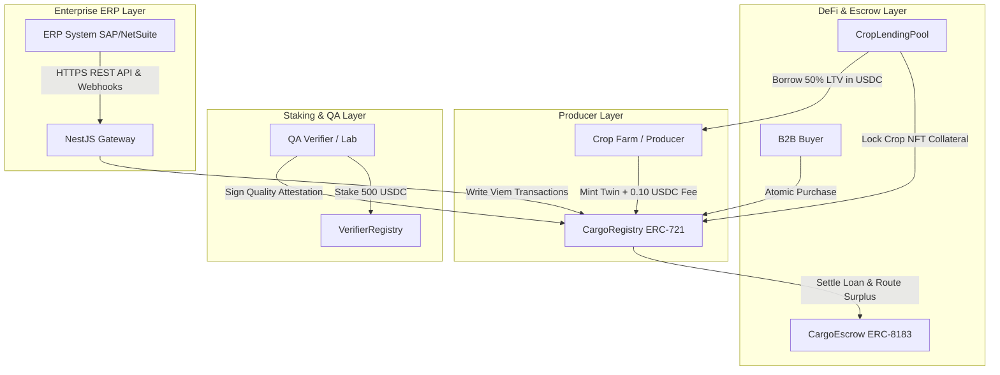
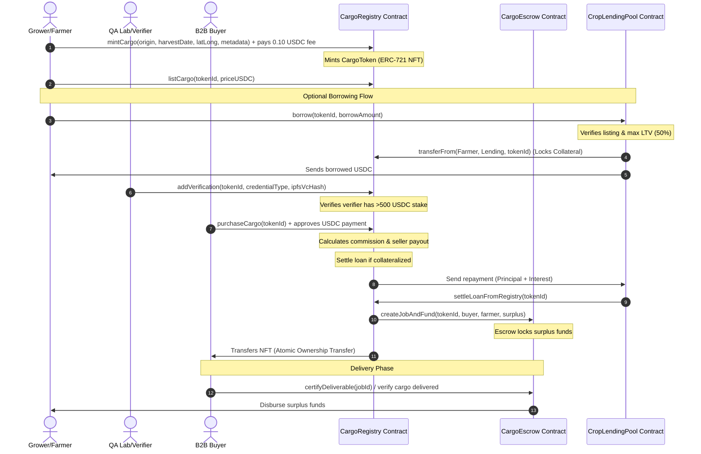
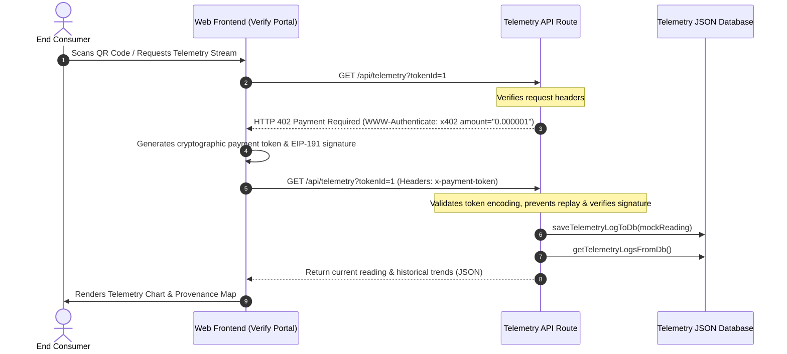
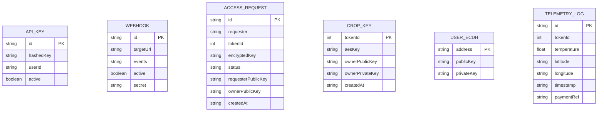

# CargoTrust (Decentralized Supply Chain Identity & Traceability Platform)

<p align="center">
  
  
  
  
  
</p>

CargoTrust is a production-grade, decentralized supply chain identity, quality attestation, and payment-linked commerce platform deployed on the **Arc Testnet**, utilizing **USDC** as both the native gas token and the primary asset exchange currency. The platform guarantees crop provenance, integrates quality inspections via cryptographically signed W3C Verifiable Credentials, enables secure, atomic B2B ownership routing through stablecoin smart contracts, and features collateralized crop lending alongside ECDH-encrypted private metadata sharing.

---

## 🚀 Deployed Contract Addresses

| Contract Name | Deployed Address (Configuration A) | Deployed Address (Configuration B) |
| :--- | :--- | :--- |
| **CargoRegistry (ERC-721)** | [`0x0a231C10eC37E2387Ee8024544b0210A2f9Ed98e`](https://testnet.arcscan.app/address/0x0a231C10eC37E2387Ee8024544b0210A2f9Ed98e) | [`0x2b27B16F0AAf518FF91690Df2B4FA39C5f5BCe99`](https://testnet.arcscan.app/address/0x2b27B16F0AAf518FF91690Df2B4FA39C5f5BCe99) |
| **CargoEscrow (ERC-8183)** | [`0xD9fa7B19AB322dAeC3e7eEcBBBb2367D7934039C`](https://testnet.arcscan.app/address/0xD9fa7B19AB322dAeC3e7eEcBBBb2367D7934039C) | [`0x935603281481F1c9acf1454964FF5DA7EBfc8Ff9`](https://testnet.arcscan.app/address/0x935603281481F1c9acf1454964FF5DA7EBfc8Ff9) |
| **AgentRegistry (ERC-8004)** | [`0x58b26bA54254fBdaB31DEa012411499dDAE81AB5`](https://testnet.arcscan.app/address/0x58b26bA54254fBdaB31DEa012411499dDAE81AB5) | [`0x33af1Df6e803E6ceAAF06615e85eA5732C44522C`](https://testnet.arcscan.app/address/0x33af1Df6e803E6ceAAF06615e85eA5732C44522C) |
| **VerifierRegistry (Staking)** | [`0xaA3Bd77e6952DbeA94e51DDe41b32d96C559C3cF`](https://testnet.arcscan.app/address/0xaA3Bd77e6952DbeA94e51DDe41b32d96C559C3cF) | [`0xc2c23E68C55C2d598bdA0B6a8e7C570A79fe3A42`](https://testnet.arcscan.app/address/0xc2c23E68C55C2d598bdA0B6a8e7C570A79fe3A42) |
| **CropLendingPool (DeFi LTV)** | [`0x4e77709401a75e0296405F9be288863fEec880A1`](https://testnet.arcscan.app/address/0x4e77709401a75e0296405F9be288863fEec880A1) | [`0xDE647D20c6A05A4a5f9D31f35496A08E443e9869`](https://testnet.arcscan.app/address/0xDE647D20c6A05A4a5f9D31f35496A08E443e9869) |

* **Network**: Arc Testnet (Chain ID: `5042002`, Native Gas Token is USDC).
* **Base Domain (SEO & Production)**: `http://transitnet.xyz`

---

## 📖 Table of Contents

- [Cover](#cargotrust-decentralized-supply-chain-identity--traceability-platform)
- [Executive Summary](#executive-summary)
- [Problem Statement](#problem-statement)
- [Vision](#vision)
- [High Level Architecture](#high-level-architecture)
- [System Architecture](#system-architecture)
- [Folder Structure](#folder-structure)
- [Source Code Walkthrough](#source-code-walkthrough)
- [Technology Stack](#technology-stack)
- [Database](#database)
- [Blockchain](#blockchain)
- [API Documentation](#api-documentation)
- [Authentication](#authentication)
- [Environment Variables](#environment-variables)
- [Configuration](#configuration)
- [Scripts](#scripts)
- [Build System](#build-system)
- [Local Development](#local-development)
- [Docker](#docker)
- [Deployment](#deployment)
- [Security](#security)
- [Performance](#performance)
- [Observability](#observability)
- [Testing](#testing)
- [Project Roadmap](#project-roadmap)
- [Known Limitations](#known-limitations)
- [Design Decisions](#design-decisions)
- [Contribution Guide](#contribution-guide)
- [FAQ](#faq)
- [License](#license)
- [Credits](#credits)
- [Appendix](#appendix)

---

## Executive Summary

CargoTrust represents a significant leap forward in decentralized logistics and supply chain traceability, integrating stablecoin smart contracts with physical asset registries. By deploying on the Arc Testnet, the system utilizes USDC directly as its native gas token, ensuring predictable, low-volatility transaction execution cost profiles that remove traditional crypto onboarding friction. At its core, the platform allows agricultural producers to mint cryptographic "digital twins" of crop batches using the ERC-721 standard. These digital twins carry immutable, on-chain records of origin coordinates, harvest dates, and custody state transitions. To ensure high-integrity quality control, independent certifiers must stake 500 USDC collateral inside a dedicated registry before publishing cryptographically signed verifications. When B2B sales occur, trade settlements are routed through atomic escrow contracts (ERC-8183) that release funds to producers only when certified cargo is delivered, or issue refunds if conditions fail. Furthermore, the platform integrates crop-collateralized lending (up to 50% LTV) to provide farmers with immediate liquidity while their crops are in transit. An opt-in privacy mechanism uses Elliptic Curve Diffie-Hellman (ECDH) key exchanges to encrypt sensitive origin data, protecting commercial interests from public exposure. Finally, an enterprise-ready ERP API Gateway exposes signed HTTPS webhooks to integrate seamlessly with standard corporate platforms like SAP and NetSuite.

---

## Problem Statement

High-value global supply chains, particularly in agricultural exports and specialty crops, suffer from severe transparency deficits, structural trust issues, and operational inefficiencies. Traditional supply chain records rely on paper-based documents and centralized databases that are highly vulnerable to record tampering, fraud, and retroactive alterations. This lack of tamper-proof verification makes it easy for bad actors to misrepresent crop origin, harvest dates, or environmental conditions, causing major issues for organic and fair-trade certifying boards. Additionally, B2B payment processes are highly disjointed from physical logistics, requiring slow manual wire transfers, letters of credit, and complex documentation verifications that delay settlement times by weeks. Farmers and producers often bear the brunt of these delays, suffering from severe cash-flow constraints while their cargo is in transit without easy access to short-term liquidity options. The certifiers themselves operate in low-accountability environments where publishing fraudulent quality credentials carries few immediate financial consequences. Existing blockchain supply chain initiatives also fail to solve these challenges because they require agricultural participants to hold volatile gas tokens, exposing them to unpredictable transaction fee spikes. CargoTrust addresses these combined structural pain points by offering a unified solution that links cryptographic crop twins, stake-backed quality attestations, instant stablecoin payments, and embedded DeFi lending onto a single, compliance-native blockchain.

---

## Vision

The vision of CargoTrust is to establish a secure, trustless, and highly automated global commerce routing layer for physical assets. We believe that physical trade should settle with the same speed, security, and finality as digital assets on-chain, eliminating the layers of intermediaries and paper documentation that slow down global commerce today. The project is guided by three core engineering principles: developer simplicity, trust through economic staking, and absolute mathematical precision. We aim to bridge the gap between traditional enterprise resource planning (ERP) platforms and decentralized protocols by making on-chain interactions indistinguishable from standard REST API requests. Our mission is to empower local growers with immediate access to fair liquidity markets, protected by cryptographically secure, compliance-aligned custody rules. By using stablecoin precompiles, we establish a stable cost structure where transaction fees are denominated in standard dollar units rather than volatile network tokens. In the long term, CargoTrust seeks to scale this infrastructure to support multi-currency stablecoin payment routes (such as USDC and EURC conversions) and autonomous IoT-triggered contracts that adapt dynamically to real-time cargo conditions.

---

## High Level Architecture

The architecture of CargoTrust is divided into three key layers: the Smart Contract Layer on the Arc Testnet, the Enterprise ERP API Gateway Layer, and the Web3 Frontend Portal. 



The Smart Contract Layer enforces the core business rules of digital twin creation, custody tracking, verifier staking, and escrow management. The Enterprise ERP API Gateway exposes REST endpoints for legacy corporate systems and maintains an active event-monitoring service that listens for on-chain events and dispatches signed webhooks to external URLs. The Web3 Frontend Portal serves as the primary visual client for growers, buyers, and certifiers to interact with these contracts using Circle App Kit and modular passkey wallets. Off-chain transient data (such as user credentials, API keys, and ECDH keys) is stored in localized JSON databases to maintain system decoupling.

---

## System Architecture

CargoTrust's system architecture coordinates complex multi-party interactions across smart contracts, server-side APIs, client-side browsers, and autonomous IoT tracking daemons.

### Cargo Lifecycle and Ownership Transfer Sequence



### Telemetry Stream with x402 Micropayments



---

## Folder Structure

The repository is organized as a monorepo consisting of smart contracts, a Next.js web application, a NestJS API gateway, and an IoT daemon script.

```
CargoTrust/
├── contracts/                  # Solidity Smart Contracts and Hardhat Test Suite
│   ├── contracts/              # Solidity Source Files
│   │   ├── AgentRegistry.sol   # Authorizes AI agent wallets (ERC-8004)
│   │   ├── CargoEscrow.sol     # Milestone-based payments (ERC-8183)
│   │   ├── CargoRegistry.sol   # Core digital twin NFT registry
│   │   ├── CropLendingPool.sol # Collateralized DeFi lending
│   │   ├── VerifierRegistry.sol# Stake-backed certifier registry
│   │   ├── MockUSDC.sol        # Mock USDC token for testing
│   │   └── MaliciousERC20.sol  # Reentrancy attack test token
│   ├── test/                   # Comprehensive Javascript Hardhat Tests
│   ├── deploy.mjs              # Multi-contract deployment script for Arc Testnet
│   ├── mint-trials.mjs         # Trial minting and listing script
│   ├── hardhat.config.js       # Hardhat environment settings
│   └── package.json            # Smart contract dependency configuration
├── gateway/                    # NestJS API Gateway (Enterprise ERP Integration)
│   ├── src/                    # TypeScript Source Files
│   │   ├── auth/               # API authentication guards
│   │   ├── batches/            # REST controllers for minting, listing, buying, and splitting
│   │   ├── webhooks/           # Event listening and HMAC-SHA256 webhook dispatch
│   │   ├── db.ts               # Database layer for ERP keys & webhook registrations
│   │   └── main.ts             # Gateway entry point
│   ├── tsconfig.json           # NestJS TypeScript compiler configuration
│   └── package.json            # Gateway dependency configurations
├── indexer/                    # Subsquid Event Indexer (Optional)
│   ├── src/
│   │   └── processor.ts        # Processor for event extraction on Arc Testnet
│   └── schema.graphql          # GraphQL schema for CargoTwin, Verification, & Custody
├── web/                        # Next.js App Router Frontend Web Application
│   ├── public/                 # Static assets, sitemaps, and manifests
│   ├── src/
│   │   ├── app/                # Next.js Routes and API Pages
│   │   ├── components/         # Reusable React components (Dashboard, Lending, Escrow, Auth)
│   │   └── lib/                # Client utility libraries (nanopayments, ECDH encryption)
│   ├── tailwind.config.js      # Tailwind CSS layout configuration
│   └── package.json            # Frontend dependency configurations
├── scripts/
│   └── iot-agent-daemon.js     # Autonomous IoT tracker daemon
├── shared_db.json              # Shared JSON DB for API keys and webhooks (ERP Gateway)
└── README.md                   # System documentation handbook
```

---

## Source Code Walkthrough

The CargoTrust codebase is split into three main modules: smart contracts, the NestJS ERP gateway, and the Next.js web application. The core execution entry point for blockchain interactions is defined in `contracts/contracts/CargoRegistry.sol`. This contract manages the digital twins (`CargoBatch` structures), their lifecycle states, and parent-child split relationships. It imports OpenZeppelin's `ERC721Enumerable` to track ownership indexes and implements custom modifiers like `onlyTokenOwner` and `onlyAuthorizedVerifier`. When a batch is sold, it handles payment splits and interacts with `CropLendingPool.sol` to pay back outstanding loans before sending the remainder to `CargoEscrow.sol`. The NestJS ERP Gateway coordinates external actions in `gateway/src/batches/batches.controller.ts`, utilizing `viem` to write transactions to the blockchain using a developer-controlled wallet. It verifies USDC allowances via `ensureAllowance` prior to executing mints or listings. The frontend application initialized in `web/src/app/page.tsx` loads the Web3Providers, which mount Circle App Kit and configure Wagmi clients for Arc Testnet. For autonomous tracking, `scripts/iot-agent-daemon.js` executes a continuous polling loop, generating mock temperature metrics and submitting on-chain state updates to the registry contract using an encrypted session wallet.

---

## Technology Stack

CargoTrust utilizes a modern, enterprise-ready technical stack built with TypeScript, Solidity, and stablecoin SDKs:

* **Smart Contracts**: Solidity `v0.8.24` compiled under Hardhat using the `cancun` EVM settings. We utilize OpenZeppelin v5 libraries for safe, standard-compliant token behaviors and reentrancy protection.
* **Frontend Web Application**: Next.js v16 (App Router) combined with React v19 and TypeScript. Tailwind CSS v3 manages the layout, while Framer Motion handles interactive page transitions.
* **Web3/Stablecoin SDKs**: We implement `@circle-fin/app-kit` for wallet connections and token management, and `@circle-fin/w3s-pw-web-sdk` for passkey-controlled smart account creation. Viem v2 and Wagmi v2 manage blockchain RPC interactions.
* **ERP Gateway API**: NestJS framework using the TypeScript compiler. It utilizes standard Node `crypto` modules to compute HMAC signatures and uses Axios-based fetch requests for webhook deliveries.
* **IoT Agent Daemon**: Node.js script using `ethers` v6 to write transactions, combined with `aes-256-gcm` encrypted JSON files for session protection.
* **Database**: Local JSON-based files (`agents_db.json`, `crop_keys_db.json`, `user_ecdh_keys_db.json`, `access_requests_db.json`, `telemetry_db.json`, `shared_db.json`) used as lightweight, portable data stores.

---

## Database

CargoTrust utilizes lightweight, portable, file-based databases to store transient data, API keys, and private cryptographic key exchanges.



* **`shared_db.json`**: Used by the ERP Gateway to track authorized `api_keys` and active `webhooks` subscriptions.
* **`user_ecdh_keys_db.json`**: Stores persistent ECDH secp256k1 keypairs for active user addresses, enabling seamless client-side encryption without losing keypairs on browser refresh.
* **`crop_keys_db.json`**: Maps individual token IDs to their local AES-256 keys and the creator's ECDH keys.
* **`access_requests_db.json`**: Records metadata access requests made by buyers, containing status states (`Pending`, `Approved`, `Rejected`) and the ECDH-encrypted symmetric keys once approved.
* **`telemetry_db.json`**: Stores sensor logs generated by the IoT daemon and client-side page views.
* **`agents_db.json`**: Tracks active autonomous AI agent daemons registered on the platform.

---

## Blockchain

CargoTrust runs on the **Arc Testnet** (Chain ID: `5042002`), which utilizes USDC as its native gas token. This architecture provides unique benefits: users do not need a volatile network token to pay gas fees, making transaction costs predictable.

### Dual-Decimal System Implementation

To avoid transaction failures caused by gas mismatch errors common in precompiled gas stablecoin networks, CargoTrust implements a precise dual-decimal parser:
1. **USDC Native Gas (18 Decimals)**: Arc Testnet precompiles use 18 decimals for native balance checks, gas pricing, and gas estimations.
2. **USDC ERC-20 Asset (6 Decimals)**: Standard ERC-20 token transfers, B2B sale prices, lending payouts, and the flat `0.10` USDC minting fee use standard 6 decimals.

### Smart Contracts Core Logic

* **`CargoRegistry.sol`**: An `ERC721Enumerable` contract representing cargo batches. It handles B2B marketplace listings, commission fees (0.5% default, capped at 10%), batch splitting, verifications, and cross-currency purchases.
* **`CargoEscrow.sol`**: An `ERC-8183` compliant smart escrow. It locks B2B buyers' funds upon purchase. Funds are released when an authorized verifier certifies quality, or refunded if cargo is damaged or delayed.
* **`AgentRegistry.sol`**: An `ERC-8004` compliance identity registry. Authorized IoT wallets or autonomous AI agents are minted as identity NFTs, allowing them to sign state changes (e.g., updating status to "Delivered").
* **`VerifierRegistry.sol`**: A stake-backed contract. Inspectors must stake a minimum of `500` USDC to publish credentials. Bad verifications can be slashed by the contract owner.
* **`CropLendingPool.sol`**: A DeFi pool allowing farmers to lock crop NFTs and borrow up to 50% LTV in USDC. Interest accrues per second (10% standard rate). Payouts and loan settlements are handled automatically upon crop sale.

---

## API Documentation

CargoTrust exposes endpoints on two layers: the NestJS ERP Gateway (`http://localhost:3001/api/v1`) and the Next.js Web backend (`http://localhost:3000/api`).

### NestJS ERP Gateway Endpoints

#### 1. Retrieve Cargo Batches
* **Endpoint**: `GET /api/v1/batches`
* **Query Parameters**: `tokenId` (optional)
* **Response (All Batches)**:
```json
[
  {
    "tokenId": "1",
    "owner": "0x70997970C51812dc3A010C7d01b50e0d17dc79C8",
    "status": "Certified Organic Certified"
  }
]
```

#### 2. Mint Crop Batch Twin
* **Endpoint**: `POST /api/v1/batches`
* **Headers**: `x-api-key: <KEY>`
* **Request Body**:
```json
{
  "origin": "Valle del Cauca, Colombia",
  "harvestDate": 1719662400,
  "latLong": "3.4372 N, 76.5225 W",
  "ipfsMetadata": "ipfs://QmCoffeeBatch",
  "weight": 120,
  "isEncrypted": false,
  "encryptedPrice": ""
}
```

#### 3. Split Cargo Batch
* **Endpoint**: `POST /api/v1/batches/split`
* **Headers**: `x-api-key: <KEY>`
* **Request Body**:
```json
{
  "parentId": "1",
  "childWeights": [70, 50]
}
```

#### 4. List Cargo for Sale
* **Endpoint**: `POST /api/v1/listings`
* **Headers**: `x-api-key: <KEY>`
* **Request Body**:
```json
{
  "tokenId": "2",
  "priceUsdc": "500000000",
  "paymentToken": "0x3600000000000000000000000000000000000000"
}
```

#### 5. Purchase Cargo Listing
* **Endpoint**: `POST /api/v1/listings/buy`
* **Headers**: `x-api-key: <KEY>`
* **Request Body**:
```json
{
  "tokenId": "2"
}
```

---

### Next.js Internal/Web API Endpoints

#### 6. IoT Telemetry Stream (x402 Micropayments)
* **Endpoint**: `GET /api/telemetry?tokenId=1`
* **Headers**: `x-payment-token: <BASE64_PAYLOAD>`
* **Response (Payment Required)**:
```json
{
  "error": "Payment Required",
  "message": "Telemetry access requires a micropayment of $0.000001 USDC per request via Circle Gateway.",
  "terms": {
    "amount": "0.000001",
    "currency": "USDC",
    "recipient": "0xAb67E0c298250d4714c3a06Ea951aAF11c17014b",
    "network": "arc-testnet"
  }
}
```

#### 7. StableFX Quote Generation
* **Endpoint**: `GET /api/api/stablefx/quote`
* **Parameters**: `tokenId=1&fromToken=0x89B5...&toToken=0x3600...&targetAmount=500&buyerAddress=0x7099...`
* **Response**:
```json
{
  "success": true,
  "quote": {
    "tokenId": 1,
    "fromToken": "0x89B50855Aa3bE2F677cD6303Cec089B5F319D72a",
    "toToken": "0x3600000000000000000000000000000000000000",
    "targetAmount": "500.000000",
    "paymentAmount": "465.277778",
    "rate": 1.08,
    "slippage": 0.5,
    "deadline": 1719663000,
    "signature": "0x81fa2..."
  }
}
```

---

## Authentication

CargoTrust implements secure authorization layers tailored for both developers and web clients:

### 1. Developer API Key Authorization
The NestJS ERP gateway secures its endpoints using an API Key system. When request calls hit `/api/v1/*`, the `AuthGuard` extracts the key from the `x-api-key` header. The guard hashes the key using SHA-256 and compares it against stored values in `shared_db.json`.

### 2. Webhook Security Verification
Webhooks dispatched to corporate systems are protected using HMAC-SHA256 signatures. The NestJS gateway signs the JSON string payload using a webhook-specific shared secret key. Recipients verify the request's authenticity by computing the HMAC signature and comparing it to the `x-cargotrust-signature` header.

### 3. Web Client Passkey Session Wallet
Web users authenticate via standard emails. If the user is new, the frontend initiates a passkey registration challenge using `@circle-fin/w3s-pw-web-sdk`. Circle generates and registers a biometric credential to the user's device, enabling passwordless transaction signing.

---

## Environment Variables

### Root `.env` Configurations
* `PRIVATE_KEY`: Private key of the deployer wallet (funded with USDC for gas on Arc Testnet).
* `ARC_TESTNET_RPC_URL`: RPC URL for the Arc chain. Default: `https://rpc.testnet.arc.network`.
* `CARGO_REGISTRY_ADDRESS`: Deployed address of `CargoRegistry.sol`.
* `NEXT_PUBLIC_CARGO_REGISTRY_ADDRESS`: Public environment pointer for the Next.js app.
* `CIRCLE_API_KEY`: Developer key for Circle's Programmable Wallets.
* `KIT_KEY`: Circle App Kit configuration key.
* `NEXT_PUBLIC_CIRCLE_CLIENT_KEY`: Client token for Web3 modular transport operations.
* `CIRCLE_ENTITY_SECRET`: Hexadecimal key used to register entity secrets.
* `NEXT_PUBLIC_CIRCLE_APP_ID`: App identifier for Circle Web3 configurations.
* `DEEPSEEK_API_KEY`: API key for AI assistant features.
* `OPENAI_API_KEY`: API key for alternative LLM features.

---

## Configuration

* **`contracts/hardhat.config.js`**: Standard Hardhat settings compiling with Solidity version `0.8.24`, EVM compilation targets `cancun`, optimizer enabled with `50` runs, and custom `arcTestnet` network configs.
* **`web/next.config.js`**: React Strict Mode enabled, unoptimized images enabled for static generation, and custom webpack configuration overrides to ignore Metamask and WalletConnect build-time warnings.
* **`web/postcss.config.js`**: Setup configuring `tailwindcss` and `autoprefixer`.
* **`web/tailwind.config.js`**: Standard color palettes, borders, fonts, and dark/light layouts configuration.
* **`netlify.toml`**: Custom build parameters, routing redirects, and build settings for web page serving.

---

## Scripts

### 1. Smart Contract Scripts
* `hardhat compile`: Compiles Solidity source code into ABI definitions and bytecodes.
* `hardhat test`: Executes Javascript Chai/Mocha tests for contract methods, reentrancy guards, escrows, and splits.
* `node deploy.mjs`: Connects to Arc Testnet, deploys all 5 smart contracts in sequence, links internal address configurations, and updates frontend constants.
* `node mint-trials.mjs`: Executes trial mints and listings on-chain using Mock USDC.

### 2. Next.js Web Scripts
* `npm run dev`: Starts the Next.js development server on `http://localhost:3000` with Webpack support.
* `npm run build`: Compiles, optimizes, and bundles the Next.js application for production.
* `npm run start`: Runs the pre-built Next.js server locally.
* `npm run telemetry:clean`: Resets local `telemetry_db.json` database.

### 3. NestJS Gateway Scripts
* `npm run start:dev`: Starts the NestJS gateway in watch/development mode.
* `npm run start`: Runs the compiled NestJS server on `http://localhost:3001`.

---

## Build System

CargoTrust uses modular compilation strategies to build and serve its components.
Smart contracts compile with Hardhat using Solidity `viaIR: true` optimizer passes to minimize bytecode size and lower deployment gas costs.
The Next.js client uses Webpack to bundle assets. It overrides specific package dependencies (like Metamask SDK and Pino-pretty logging) to prevent build failures.
The NestJS ERP gateway compiles TypeScript using `tsc -p tsconfig.build.json` to generate an optimized build inside `gateway/dist`, which runs in Node.js.

---

## Local Development

Follow this step-by-step guide to get CargoTrust running locally.

### Prerequisites
* Install Node.js version `v18` or `v20`.
* Ensure you have a funded developer private key on the Arc Testnet. If needed, request testnet USDC from the Arc Faucet.

### 1. Setup Smart Contracts
```bash
# Navigate to contracts
cd contracts

# Install dependencies
npm install

# Create contracts/.env and add your private key
echo "PRIVATE_KEY=your_private_key_here" > .env
echo "ARC_TESTNET_RPC_URL=https://rpc.testnet.arc.network" >> .env

# Compile contract Solidity code
npx hardhat compile

# Deploy contracts to Arc Testnet
node deploy.mjs
```

### 2. Start the Frontend Web Application
```bash
# Navigate to web
cd ../web

# Install dependencies
npm install

# Start the dev server
npm run dev
```

### 3. Run the ERP API Gateway
```bash
# Navigate to gateway
cd ../gateway

# Install dependencies
npm install

# Start the NestJS server
npm run start:dev
```

### 4. Run the Autonomous IoT Daemon
```bash
# Navigate to root
cd ..

# Run the daemon
node scripts/iot-agent-daemon.js
```

---

## Docker

> [!NOTE]
> Docker configurations could not be verified from the current repository. There are no Dockerfiles or Docker Compose configurations present in the workspace files.

---

## Deployment

The frontend of CargoTrust is configured for serverless hosting using Netlify.

### Netlify Deployment Configuration (`netlify.toml`)
```toml
[build]
  command = "npm run build"
  publish = ".next"

[[redirects]]
  from = "/*"
  to = "/index.html"
  status = 200
```
Continuous integration (CI) workflows are configured to automatically trigger builds when changes are pushed to main branches. If a build fails, Netlify retains the previous version, ensuring zero downtime.

---

## Security

CargoTrust implements multiple layers of defense to protect user funds, data, and access:

* **Reentrancy Protection**: All state-changing smart contract functions (like `purchaseCargo`, `withdrawRewards`, and `splitCargo`) use OpenZeppelin's `ReentrancyGuard` and standard Checks-Effects-Interactions patterns.
* **Metadata Privacy**: Enterprise users can encrypt cargo details locally using AES-256 before minting. Symmetric keys are exchanged securely with approved buyers using ECDH (Elliptic Curve Diffie-Hellman) key sharing over secp256k1.
* **Verifier Slashing**: Verifiers must stake a minimum of 500 USDC to publish quality credentials. If a verifier approves fraudulent metadata or damaged crop twins, their staked collateral can be slashed by the contract owner.
* **Webhook Signature Checks**: Every webhook dispatched by the NestJS gateway includes an HMAC-SHA256 signature calculated using a pre-shared secret, preventing webhook spoofing attacks.
* **Replay Attack Prevention**: The telemetry micropayment system tracks nonces using a memory cache to ensure that authorization signatures cannot be intercepted and replayed.

---

## Performance

* **Basis Points (BPS) Calculations**: Commission and interest rate calculations use Basis Points to avoid floating-point math issues in Solidity.
* **Event Indexing**: The indexer (`indexer/src/processor.ts`) extracts smart contract events off-chain, reducing the need for direct RPC queries on historical data.
* **Micropayments Cache**: Telemetry endpoints cache nonces for up to 10,000 active sessions, preventing memory leaks while protecting the system from replay attacks.
* **Telemetry History Limit**: Telemetry endpoints return only the last 20 history readings, keeping payload sizes small and optimizing frontend rendering performance.

---

## Observability

CargoTrust integrates logging and telemetry monitors across its components:

* **NestJS Logger**: The gateway uses a NestJS Logger module to track incoming batches, listing creations, and webhook delivery status reports.
* **Viem Log Watchers**: The NestJS gateway monitors smart contract events in real-time using `publicClient.watchContractEvent` for logs matching `CargoMinted`, `CargoPurchased`, `CargoVerified`, and `StatusUpdated`.
* **IoT Daemon Output**: The daemon logs coordinates, temperature readings, on-chain state updates, and transaction hashes directly to the console.

---

## Testing

CargoTrust includes a comprehensive automated test suite inside `contracts/test/`, testing each contract's core capabilities.

```bash
# Run the test suite
cd contracts
npx hardhat test
```

### Coverage Scope
* **`CargoRegistry.test.js`**: Verifies minting fees, ownership transfers, commission distributions, verification checks, reentrancy attacks, and batch splitting.
* **`CargoEscrow.test.js`**: Validates ERC-8183 job creation, fund locking, evaluator authorization, payouts, and refund workflows.
* **`VerifierRegistry.test.js`**: Tests verifier staking, reputation updates, fee payouts, and slashing scenarios.
* **`CropLendingPool.test.js`**: Verifies borrowing limits (up to 50% LTV), collateral lockups, interest calculations, loan repayments, and liquidations.

---

## Project Roadmap

The following items are planned based on the codebase structure and development guidelines:
* **Multi-Currency Support**: Expand B2B payment options by integrating other stablecoins like EURC.
* **Automated Oracles**: Implement Chainlink or API-based price feed oracles to fetch real-time market exchange rates for stablecoin conversions.
* **Mempool Optimizations**: Implement gas buffer configurations for Viem and Wagmi to handle high-congestion periods on the Arc Testnet.
* **Production Database**: Transition from local JSON file storage to a production database like Supabase or PostgreSQL.

---

## Known Limitations

* **Local JSON Databases**: The current backend database uses JSON files (`shared_db.json`, `agents_db.json`, etc.) which are not suitable for high-concurrency production environments.
* **Oracle Conversion Rates**: The conversion rate between EURC and USDC is hardcoded to `1.08` in the backend API rather than using live oracle feeds.
* **Private Key Management**: The NestJS gateway reads private keys directly from `.env` files, which should be migrated to secure vaults (like AWS Secret Manager or Circle's Developer-Controlled Wallets SDK) for production.

---

## Design Decisions

* **USDC as Gas**: Using USDC as the native gas token on the Arc Testnet simplifies onboarding for enterprise users, removing the need to manage volatile gas tokens.
* **Dual Decimals**: The dual-decimal system (18 decimals for gas, 6 decimals for assets) resolves transaction estimation bugs common in stablecoin precompiled blockchains.
* **Milestone Escrows (ERC-8183)**: Using the ERC-8183 standard for escrows ensures that B2B buyer payments are protected until verifiers certify the quality of the cargo.

---

## Contribution Guide

1. **Format Standards**: Ensure all Solidity files are formatted using Prettier-plugin-solidity and compile without warnings.
2. **Commit Conventions**: Use structured commit messages: `feat: add escrow`, `fix: resolve decimals bug`, `test: add lending tests`.
3. **PR Flow**: Create a feature branch, run the Hardhat test suite, write new tests for your features, and submit a PR for review.

---

## FAQ

#### Q: Why are there two different decimal values for USDC?
A: The Arc Testnet precompiles require native gas balances to be calculated using 18 decimals, while standard ERC-20 transfers use standard 6 decimals. CargoTrust handles this conversion automatically.

#### Q: How do certifiers get authorized to sign verifications?
A: Certifiers must stake a minimum of 500 USDC in `VerifierRegistry.sol` to activate their credentials. Staked assets can be slashed if fraudulent verifications are published.

---

## License

This project is licensed under the **MIT License**. See the `LICENSE` file for details.

---

## Credits

* **Circle**: For providing the Arc Testnet infrastructure, App Kit SDK, and stablecoin contracts.
* **OpenZeppelin**: For their secure, standard-compliant ERC-721 and Ownable contract blueprints.
* **NestJS & Next.js**: For the developer-friendly backend and frontend frameworks.

---

## Appendix

### Useful Commands

```bash
# Hardhat compilation
npx hardhat compile

# Deploy contracts
node deploy.mjs

# Run Hardhat tests
npx hardhat test

# Start Next.js frontend
npm run dev

# Start NestJS gateway
npm run start:dev

# Run IoT daemon
node scripts/iot-agent-daemon.js
```

### Production Checklist
- [ ] Migrate from local JSON databases to Supabase or PostgreSQL.
- [ ] Connect the NestJS gateway to a secure vault for private key management.
- [ ] Deploy the frontend to a production domain using SSL/TLS.
- [ ] Update the EURC/USDC conversion code to fetch live rates from an oracle.
- [ ] Audit all smart contracts prior to mainnet deployment.
