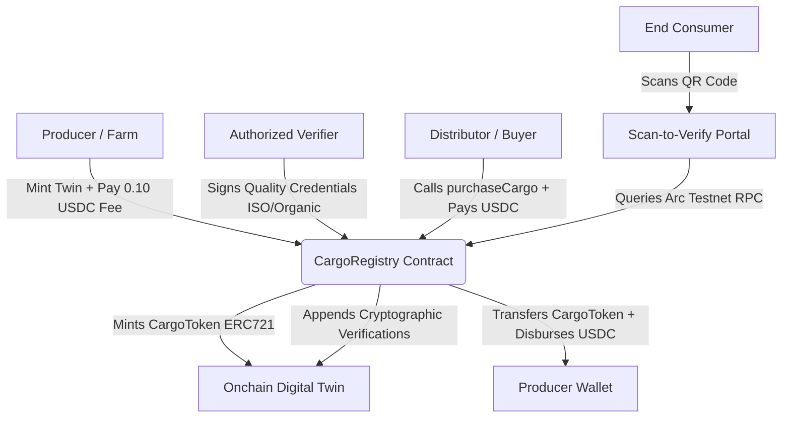

# Implementation Plan: CargoTrust Traceability Platform

CargoTrust is a Decentralized Supply Chain Identity & Traceability Platform built on Circle's **Arc Testnet** and utilizing USDC for gas and payments.

## Architecture & Strategy

---

## 4 Core Features & Integrations

### Feature A: Product Digital Twin Creator
- **Smart Contract**: ERC-721 based `CargoRegistry.sol` token representing physical cargo batches.
- **On-chain Metadata**: Batch ID, coordinate coordinates (lat/long), harvest date, origin details.
- **USDC Mint Fee**: Charges a $0.10$ USDC minting fee paid to the platform treasury.

### Feature B: Payment-Linked Ownership Transfer Contract
- **Atomic Swap**: Distribution centers buy batches using USDC.
- **Execution Flow**: `purchaseCargo(uint256 tokenId)` fetches price, verifies allowance, executes `usdc.transferFrom(buyer, seller, price)` and transfers NFT atomically.

### Feature C: Authorized Verifier Credentials Dashboard
- **Role-Based Attestations**: Independent labs or certifiers (e.g., FairTrade, Organic) sign cryptographically to certify products.
- **On-chain Attestation**: `addVerification(uint256 tokenId, string credentialType, string ipfsVcHash)` links certificates permanently to the token.

### Feature D: End-Consumer Scan-to-Verify Portal
- **Zero-Login Reader**: Access via secure QR URL (e.g., `/verify?tokenId=1`).
- **Complete Provenance**: Visualizes harvest location, quality credentials, chain of custody, and verified USDC financial records by reading block history.

---

## Technical Stack
1. **Core**: Solidity Smart Contracts, Hardhat, Ethers.js for compilation and deployment.
2. **Frontend**: Next.js (App Router), Tailwind CSS v4, Lucide Icons, Framer Motion (for elegant design).
3. **Web3**: Viem v2, Wagmi, Circle App Kit (`@circle-fin/app-kit`), `@circle-fin/adapter-viem-v2` for unified cross-chain adapters and wallet support.
4. **Database**: Supabase / JSON-based local DB for storing transient off-chain metadata (mapping QR code identifiers to Token IDs).

---

## Implementation Steps

1. **Smart Contracts Setup**: Write `CargoRegistry.sol` including minting, purchase, verification registry, and fee collection.
2. **Deployment Script**: Write `deploy.mjs` to deploy to **Arc Testnet** (Chain ID: `5042002`) using the custom USDC precompile gas token.
3. **Next.js Web Scaffolding**: Setup package.json, next.config, Tailwind config, and Web3Providers.
4. **Integration of Circle SDKs**: Set up App Kit & Viem Adapters.
5. **UI Pages**: Build beautiful dashboard pages with futuristic look, neon glows, map indicators, and smooth state handling.
6. **Consumer Verification Portal**: Build the public-facing provenance path.
7. **End-to-End Testing**: Execute contract compiler, deployer, and verify front-to-back flow.
